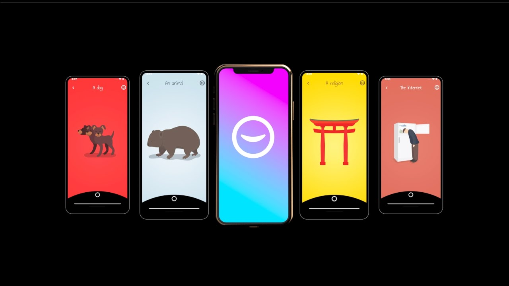
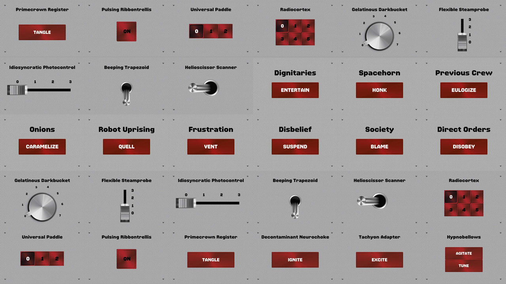
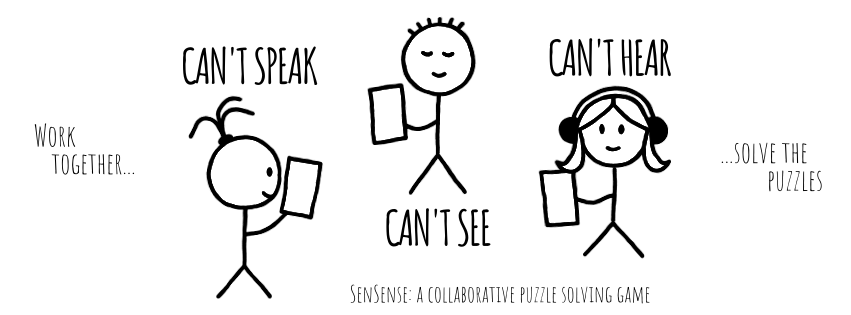

# Actually Good Mobile Games

Mobile gaming is big, and it's only going to keep growing. It already accounts for [more than half of the total gaming revenue worldwide](https://www.statista.com/topics/1906/mobile-gaming/). Unfortunately, I find myself feeling quite cynical about mobile games these days as so many of them are filled to the brim with advertisements and micro-transactions. 

With so many new games hitting the market every day, I have no doubt there are countless gems worth playing among them. Every once in a while, I find one. Here are some I've played recently that I can wholeheartedly recommend. Some of the games I will list are completely free, some have a large amount of content that is free and ad-free with optional paid extra content, and some are paid but don't have any extra micro-transactions after the initial purchase.

## Florence

Florence is one of the simplest games I've ever played. Most of your interactions with the game are completing unremarkable tasks. The story itself isn't even that original. And yet, it's the first game that made me cry.

## Song of Bloom

## Pianista

## Imagzle

## Spaceteam

## SenSense

## Zip Zap

