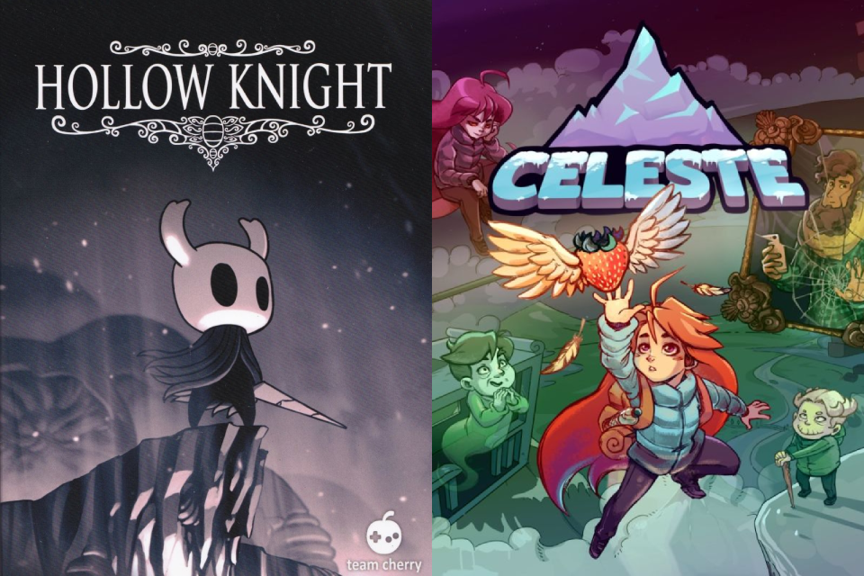
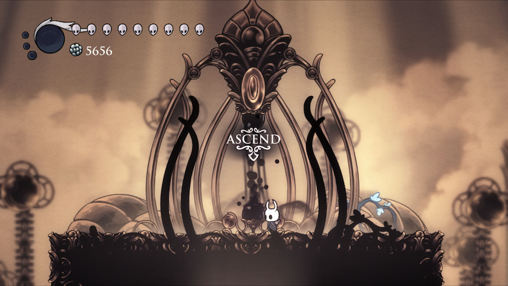
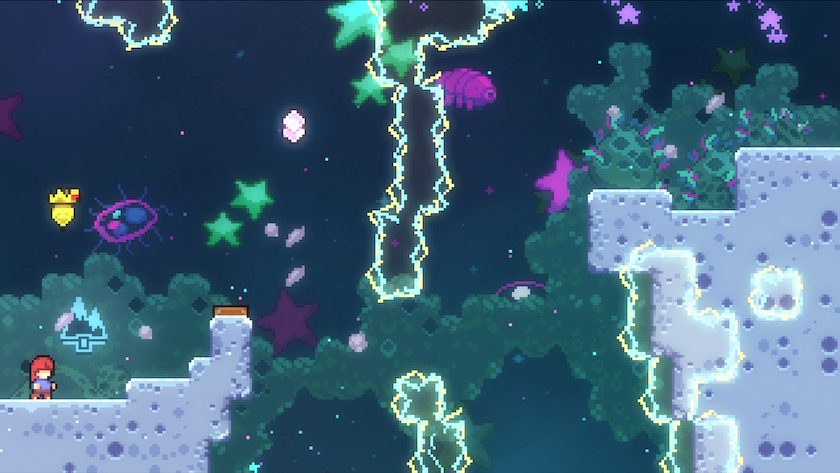
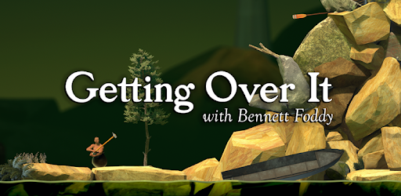
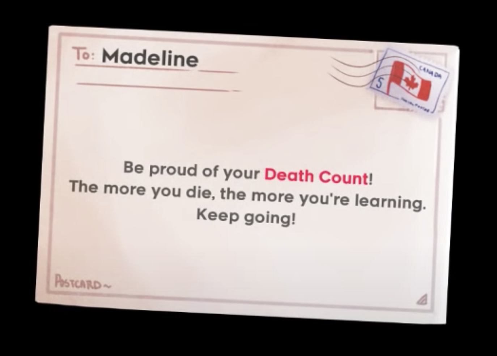

<svelte:head>
	<title>Doga Tekin on Game Frustration</title>
    <base target="_blank">
</svelte:head>

# {title}

Hollow Knight and Celeste are two of my favourite games from the last few years. I have spent almost 50 hours in Hollow Knight's world and 30 in Celeste's. A good portion of the time I spent in both games went towards completing some of the hardest challenges each game has to offer.

After completing Hollow Knight, I noticed I had a sour taste in my mouth; I was still feeling the effects of the excess frustration that had built up during the final hours. I thought back to my time finishing Celeste but couldn't remember having the same negative feeling. Celeste had managed my frustration perfectly, building it up _just enough_ that I would feel an immense satisfaction at the end but not so much that it would spill over and leave me feeling angry. Hollow Knight, on the other hand, had annoyed me so much in the final few hours that I couldn't even fully enjoy my eventual victory.

As a gamer who has been interested in game design for some time, I wanted to dig a little deeper into these feelings and explore some of the differences between the two games in this blog post. Minor spoilers ahead!

## Some Context

In Hollow Knight you play as a bug knight exploring the Kingdom of Hallownest. Along the way you gain abilities, overcome platforming challenges, fight enemies, and battle lots of bosses.

In Celeste you play as Madeline, trying to climb a magical mountain. On your way to the summit, you go through increasingly difficult platforming challenges with plenty of different mechanics.

The two games actually have a lot in common:

- Both are made by a small number of very skilled people.
- Both feature amazing visuals and original soundtracks.
- Both provide incredible value for money.
- Both are difficult experiences, with even harder optional challenges for those who really want to push themselves.

Finally, both games received their most difficult main challenges<a href="#fn1" class="footnote-ref" id="fnref1" role="doc-noteref" target="_self">1</a> in the form of free downloadable content (DLC) packs, and these are what I will be talking about in this post.

The ultimate challenge in Hollow Knight is the Pantheon of Hallownest (PoH), which arrived with the Godmaster DLC. It is a gauntlet through 42 bosses (virtually all boss enemies in the game), ending with arguably the most difficult one: Absolute Radiance. There are no checkpoints, which means losing any battle takes you all the way back to the start.

<figure>
    
    <figcaption>Fun coincidence: the word of choice for taking on Pantheon of Hallownest is “Ascend”, just like you ascend the mountain in Celeste.</figcaption>
</figure>

The ultimate challenge in Celeste is the final chapter, which is aptly named Farewell and it arrived in the final update to the game. It is a huge chapter that introduces lots of new mechanics and requires the use of many advanced techniques, and it is intended to be harder than all of the previous challenges in the game.

Coincidentally, both [PoH](https://www.youtube.com/watch?v=y3navOsvDCw) and [Farewell](https://www.youtube.com/watch?v=qyOapJgLcEI) can be completed in a single sitting of around 40 minutes if you are (very) good at them<a href="#fn2" class="footnote-ref" id="fnref2" role="doc-noteref" target="_self">2</a>. Of course you are not very good at either when you first get to them, so it takes considerably longer to finish them. For reference, it took me 6 hours and 2400 deaths to finish Farewell. I don't actually know how long it took me to beat PoH, but I think 6 hours wouldn't be a bad estimate including my practice time in the Hall of Gods (an area where you can practice individual fights of the Pantheon of Hallownest to prepare yourself for the real challenge.).

All that to say, I think these are challenges of comparable difficulty and length so it's not unfair to pit them against each other in this analysis of player frustration.

## Frustration In Games

<Quote cite="Oxford Languages">
    <strong>frustration:</strong> the feeling of being upset or annoyed as a result of being unable to change or achieve something.
</Quote>

Even though it sounds like a negative term, I don't think it's necessarily bad for a game to be frustrating. If it was, games like Dark Souls and Cuphead wouldn't be so popular.

<figure >
    
    <figcaption>Nor would this one.</figcaption>
</figure>

Hard games are inherently frustrating because they entail failing over and over again at challenges, which is almost always upsetting and annoying. It is outside the scope of this post to speculate about why certain people love these types of games. For those interested, _Daryl Talks Games_ has a great deep-dive on [Why We Keep Playing Brutally Tough Games](https://www.youtube.com/watch?v=H8cavOfbwHw).

All I know is that I am very fond of challenging games. I don’t say that as a brag; I don’t think enjoying hard games means you are more determined or more skilled in general than those who don’t like these games. I say that to let you know I actually _enjoy_ going through periods of frustration in games (to an extent) in order to feel the sense of accomplishment that comes when I eventually succeed.

In mind-bending puzzle games like _Baba is You_, I love the moment a puzzle just clicks after hours of being stuck on a level. In platforming games like _Celeste_, I love observing my brain get better and better at levels I failed hundreds of times before. And in games like _Hollow Knight_, I love slowly figuring out how a boss works and landing that final blow after many, many failed attempts.

<Quote cite="Bennett Foddy, Getting Over It">
    Imaginary mountains build themselves from our efforts to climb them, and it’s our repeated attempts to reach the summit that turns those mountains into something real.
</Quote>

Despite being an integral part of the experience for many gamers, the feeling of frustration itself isn’t very positive. Game designers must work hard to _manage_ player frustration if they want to create the most enjoyable experience possible.

Not all frustrations are created equal<a href="#fn3" class="footnote-ref" id="fnref3" role="doc-noteref" target="_self">3</a>. I’ll roughly categorise them into three groups here:

1.  **Essential:** These are frustrations that are inherent to making a truly difficult game. Players will have to fail repeatedly until they overcome the game’s challenges, which is naturally upsetting. You shouldn’t hope to eliminate this type of frustration if you want your game to be satisfying, but you should carefully manage the difficulty curve. Your game has to keep challenging the player without overwhelming them, gradually increasing the difficulty as the player improves.
2.  **Avoidable:** These are features or bugs that manage to upset and annoy players without necessarily adding anything positive to the experience. They might result from game design decisions, technical issues or oversights. They can and should be avoided.
3.  **Trade-off:** These are a middle ground between the above types. These are frustrations that bring something positive to the experience at the cost of upsetting the player. They may be inherent to the game genre or might be an optional game feature.

I don’t have much to say about essential frustrations here, both games have a very well balanced difficulty curve for the majority of their playtime. Instead, I want to talk about some avoidable frustrations in Hollow Knight and some trade-offs both games had to make to manage player frustration.

## Respect for the Player’s Time and Quality of Life

I’ll start with what I think is the single biggest flaw of the Pantheon of Hallownest: the avoidable frustration of wasting time.

First, look at how long it takes you to retry a screen in Celeste:

<YouTube src="https://www.youtube.com/embed/ETpU_uCg4nY" />

Now, look at how long it takes you to retry the final boss in Hollow Knight (spoilers if you don’t want to see the final boss):

<YouTube src="https://www.youtube.com/embed/D3gQQQQiRyQ" />

If you fail anywhere in Celeste, you _instantly_ respawn and get to try again. If you fail this boss in Hollow Knight, it takes **over 30 seconds** to get up, challenge the boss again, watch the unskippable introduction animation and the title card to try the fight again. Granted, not every boss in the game has such a long and dramatic introduction, but most have some annoying wasted time.

Also note this is probably the hardest boss in the game. That means you might very well try this battle dozens of times, with no choice but to go through this process over and over again.

Unfortunately, that’s not all. What I explained above is what happens when you are practising an individual fight. When you fail a battle in the actual pantheon, you have to go through the entire set of bosses again from the start (not to mention also watch all of their intro sequences).

I certainly get the appeal of making the ultimate challenge function this way; if you want to prove you’ve mastered the game, you show that you can beat every single boss one after another. This could have been perfectly fine, except **at least half of the 42 bosses don’t even pose a challenge to a player at this level**.

Any player who has unlocked the Pantheon of Hallownest needs to have gone through four other 10-boss pantheons, showing that they can at least beat 40 of the bosses. Most of these players have probably played the game for many hours at this point, and have most if not all of the upgrades that can be obtained in the game. They are comfortable with the fighting mechanics, and they know the tactics of most bosses. Most of their failed attempts will be caused by the hardest final few bosses in the pantheon.

So, when the game makes you go through this boss every time you fail:

<YouTube src="https://www.youtube.com/embed/u49HHxSMX7s" />

you cannot help but feel like you are wasting your time.

Imagine how you would feel if Celeste made you go through the easiest obstacles from the very first level every time you died in Farewell, even though they are so far below your level at that point that you could do them with eyes closed. Moreover imagine being allowed to keep your late-game abilities and techniques that would let you just breeze through these easy obstacles. It would be infuriating in Celeste, and it is infuriating in Hollow Knight.

The core difference between the two games here is how they punish failure. Celeste punishes you by instantly resetting you to the start of the screen and giving you another chance at the challenge you failed, which is great because often that’s exactly what you want to do when you fail a challenge. Hollow Knight punishes you by wasting your time, either by forcing you to literally wait through animations or do trivial tasks like fighting weak enemies.

This could have been avoided by making the intro sequences skippable and changing the last challenge to be only the 10-15 hardest bosses in the game. It would still be just as formidable a trial; several difficult but engaging battles with very little downtime, you would have to perform at your best to go through them all. I have no doubt it would give you the same satisfaction of mastering the game, without all of this extra frustration.

## Randomness and Hostility

<Quote cite="Jesper Juul, The Art of Failure">
    While we dislike feeling responsible for failure, we dislike even more strongly games in which we do not feel responsible for failure.
</Quote>

In most of Celeste (I’ll address the exceptions in a minute), you are climbing the mountain by yourself, jumping and dashing to get through obstacles. It’s not an easy climb up, but the mountain isn’t _actively trying to kill you_. If you fall down a pit on your first try, the pit will be in the exact same spot the next time you get there. If you do manage to get over that pit, it won’t become larger or suddenly grow spikes on its edges, it will just continue to exist as an obstacle you conquered. That’s what the mountain does, it just _exists_. You are the one that took on climbing it as a challenge, and the onus is on you to learn to navigate its landscape. The mountain is constant, consistent and it’s mostly indifferent to you.

As a result, you almost always feel responsible for your failures in Celeste. The frustration you feel is that of being not good enough (yet).

In Hollow Knight, on the other hand, you have _enemies_. They watch you, they talk to you, they react to you and they try their best to kill you. They certainly aren’t as unpredictable as a human, but most of them won’t stand in the same spot and keep doing the same move over and over again. They might perform interesting sequences of moves, randomly decide to change directions and walk into you, or spawn a projectile right in front of you and catch you off-guard. They are hostile and random.

As a result, you don’t always feel responsible for your failures. In such cases, the frustration you feel is that of being cheated out of your victory, because of your “stupid luck” or that “stupid enemy”. Search the Hollow Knight subreddit for posts about Markoth for examples.

<figure>
    <YouTube src="https://www.youtube.com/embed/plHD6geJZm4" />
    <figcaption>Pay attention to the final criss-cross of blades for an example of what feels like a random unavoidable attack.</figcaption>
</figure>

In the instances where Celeste introduces other characters as adversaries, they are much less random. They almost always act in reaction to your moves: one of them literally follows your movement but just from a little behind, the other tracks your height to decide how to attack, and so on. This makes it easier to get consistent at beating them, but you might still find them more annoying than the more static levels in the game.

<figure>
    <YouTube src="https://www.youtube.com/embed/Kr65tNArXmk" />
    <figcaption>A hostile but non-random enemy.</figcaption>
</figure>

To be clear, I’m not saying this is something to be fixed. The randomness and hostility are the things that make Hollow Knight’s combat fun. Just look at this clip from an amazing fight in the game:

<YouTube src="https://www.youtube.com/embed/ZBvF21yQZ-c" />

It would _suck_ if these enemies had a fixed pattern you could just memorise; the fight would only be fun on your first few attempts, at most. Almost all of the joy here comes from being able to react to the attacks just in time, expertly dodging between spears and being part of this elegant back-and-forth performance. And it’s still fun for me even after I’ve beat them several times.

This creates a trade-off: the randomness and hostility provide increased replayability at the cost of additional frustration when they result in situations that upset the player.

I believe this point holds even in real life. If you are a mountain climber, how mad can you get at a mountain if you fail to scale it? But if you are playing a competitive sport, you’ll probably find it very easy to get mad at your opponents. On the other hand, you might find yourself losing interest more quickly if you keep climbing the same mountain than if you were competing with the same opponent, who might act a little differently each time you clash.

“Ok,” you might say, “but what about the developers? Surely I can blame and get mad at the developers of Celeste for making the obstacles too hard.” Which brings us to my final topic.

## Tone of the Game

Here is a clip from the prologue of Celeste, where you are first introduced to the important dash mechanic:

<YouTube src="https://www.youtube.com/embed/-o33zF7hp9g" />

This support continues throughout the game at important points. Sometimes you feel the support of the characters in the game, and sometimes you get fourth-wall breaking messages seemingly directly from the developers.

<figure>
    
    <figcaption>Did I mention that I died 9000 times in this game?</figcaption>
</figure>

Even at the very end, if you die 50 times in the last screen of Farewell, you get the following little dialogue:

<figure>
    <YouTube src="https://www.youtube.com/embed/qQrCopSSg5s" />
    <figcaption>By the way, I couldn’t find any mention of this scene on the internet. Am I the only one bad enough to die 50 times on this screen?</figcaption>
</figure>

There are supporting characters in Hollow Knight too, but they are more or less contained to the main story. In Godhome, where the Pantheon of Hallownest is located, you are mostly made to feel unwelcome. You are called a speck, a trespasser and a blasphemer for being there to challenge the Gods (the bosses). Only after you prove yourself in the harder challenges, you find some acceptance. When you beat the final boss in the practice room, you get this bit of provocative pat on the back:

<YouTube src="https://www.youtube.com/embed/gqSaFO3I1Jg" />

Again, I’m not saying Godhome should have been filled with cheerleader bugs (although it would be amusing) or Team Cherry should have interrupted the game to tell you the next boss is actually really hard and not to worry about failing. They’ve clearly worked hard to create an immersive experience, and either of those changes would take away from the bleak, hostile atmosphere that is an integral part of the game.

This is just another trade-off I noticed, where the developers of Celeste decided to give me some surprisingly effective motivational support at the cost of breaking the immersion here and there.

## Conclusion

The goal of this post was to explore my negative feelings towards the end of Hollow Knight and understand how Celeste managed to avoid creating the same feelings. I can now conclude that Celeste was better at eliminating avoidable frustrations and the developers made several trade-offs to decrease frustration and make the experience more enjoyable.

Despite my minor annoyances about its final challenge, Hollow Knight is still right up there with Celeste in the list of my favourite games. I found it interesting from a game design perspective to explore why its last few hours frustrated me so badly, and I hope you did too. I can’t wait to get my hands on the next Hollow Knight game, Silksong, and get frustrated by a whole new set of challenges!

<h4>Footnotes</h4>
<ol>
<li id="fn1" role="doc-endnote">
    
Both games have optional even harder challenges, namely Radiant difficulty bosses in Hollow Knight and golden strawberries in Celeste, but I would not consider them <em>main challenges</em>. <a href="#fnref1" class="footnote-back" role="doc-backlink" target="_self">↩︎</a>

</li>
<li id="fn2" role="doc-endnote">
    
Or if you are a speedrunner, in about 18 minutes (<a href="https://www.youtube.com/watch?v=TmcxrvqUiTU">PoH</a> in 17:45 and <a href="https://www.youtube.com/watch?v=1ixUthQF2p4">Farewell</a> in 17:50). <a href="#fnref2" class="footnote-back" role="doc-backlink" target="_self">↩︎</a>

</li>
<li id="fn3" role="doc-endnote">
    
<a href="https://www.foddy.net/2017/01/eleven-flavors-of-frustration/">Here</a> are eleven different flavors as explained by Bennett Foddy, although that’s not really the distinction I’m trying to make in this context. <a href="#fnref3" class="footnote-back" role="doc-backlink" target="_self">↩︎</a>

</li>
</ol>