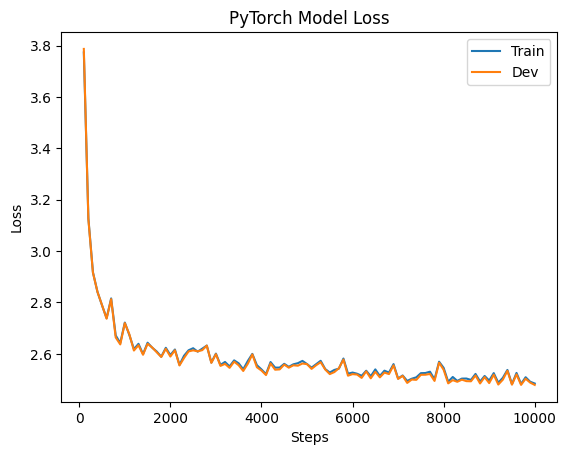
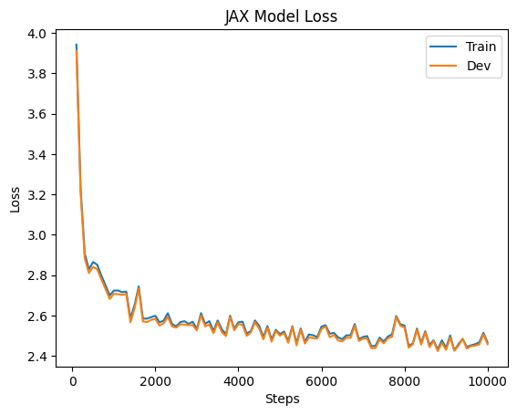
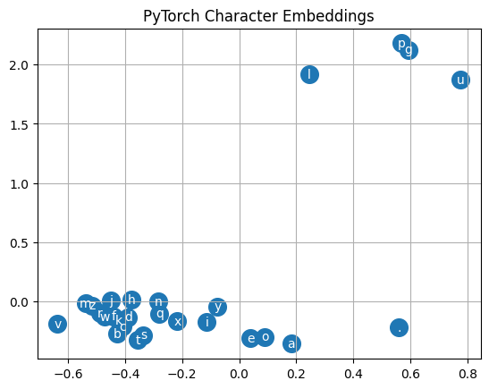
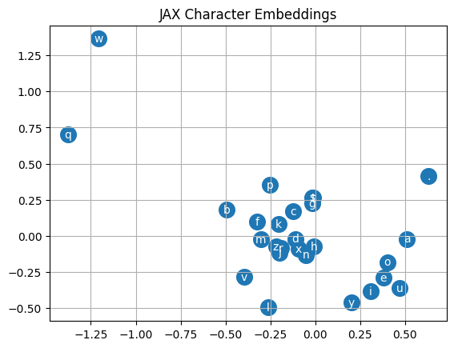

<script>
    import Tabs from '$lib/Tabs.svelte';
    import { base } from '$app/paths';
    import './assets/atom-dark.css';

    let tabItems = ['Torch', 'JAX']
	let activeItem = 'JAX'

	const triggerTabChange = (event) => {
		activeItem = event.detail;
	}
</script>

<svelte:head>

    <title>Doga Tekin on Learning JAX</title>

</svelte:head>

# {title}

[JAX](https://github.com/google/jax) is a cool machine learning framework from Google.
Language models (LMs) are the family of models that include ChatGPT and GPT-4, which have taken the machine learning world by storm.

What better way to learn about both than to implement a simple LM in JAX?

## Resources

I'll heavily rely on Andrej Karpathy's amazing course [Neural Networks: Zero to Hero](https://karpathy.ai/zero-to-hero.html) for this implementation.
The course starts from the very basics of neural networks and slowly builds up to implementing a GPT model.

If you are interested in learning about all of these things in detail, I highly recommend checking the course out.
This blog post is only concerned about porting the implementation to JAX, and won't go into the theoretical background of what is being implemented.

As for JAX, I've found the [official documentation](https://jax.readthedocs.io/en/latest/index.html) adequate so far.

## Model

The model I'm interested in building is the Multi Layer Perceptron (MLP) model from [Building makemore Part 2: MLP](https://www.youtube.com/watch?v=TCH_1BHY58I).
I think this is a good starting point due to the simplicity of the model built in this chapter.

Following the steps in this video, I will be building a character-level LM that looks at the previous three characters to predict which character will come next.

## Implementation

While displaying the relevant code blocks, I'll also provide the PyTorch counterparts in a separate tab for easier comparison.

Let's start by initializing the model parameters:

<Tabs tabItems = {tabItems} activeItem = {activeItem} on:tabChange={triggerTabChange} />
{#if activeItem === 'Torch'}

```python
alphabet_size = 27
context_size = 3
neurons = 100
d = 2

g = torch.Generator().manual_seed(2147483647)

C =  torch.randn(generator=g, size=(alphabet_size, d))
W1 = torch.randn(generator=g, size=(d * context_size, neurons))
b1 = torch.randn(generator=g, size=(neurons, ))
W2 = torch.randn(generator=g, size=(neurons, alphabet_size))
b2 = torch.randn(generator=g, size=(alphabet_size, ))

parameters = [C, W1, b1, W2, b2]
```

{:else if activeItem === 'JAX'}

```python
alphabet_size = 27
context_size = 3
neurons = 100
d = 2

key = jrandom.PRNGKey(0)
key, *subkeys = jrandom.split(key, 6)
subkeys = iter(subkeys)

C = jrandom.normal(next(subkeys), shape=(alphabet_size, d))
W1 = jrandom.normal(next(subkeys), shape=(d * context_size, neurons))
b1 = jrandom.normal(next(subkeys), shape=(neurons, ))
W2 = jrandom.normal(next(subkeys), shape=(neurons, alphabet_size))
b2 = jrandom.normal(next(subkeys), shape=(alphabet_size, ))

parameters = [C, W1, b1, W2, b2]
```

{/if}

You can notice they are very similar.
Other than method and parameter names, the only difference is how JAX handles random number generation.
You can read more about that in the corresponding section of [🔪 JAX - The Sharp Bits 🔪](https://jax.readthedocs.io/en/latest/notebooks/Common_Gotchas_in_JAX.html#random-numbers).

Now let's write the forward pass:

<Tabs tabItems = {tabItems} activeItem = {activeItem} on:tabChange={triggerTabChange} />
{#if activeItem === 'Torch'}

```python
def model(C, W1, b1, W2, b2, X):
    emb = C[X]
    h = torch.tanh(emb.view(-1, 6) @ W1 + b1)
    logits = h @ W2 + b2
    logits -= logits.max(1, keepdims=True).values
    counts = torch.exp(logits)
    probs = counts / counts.sum(1, keepdims=True)
    return probs
```

{:else if activeItem === 'JAX'}

```python
def model(C, W1, b1, W2, b2, X):
    emb = C[X]
    h = jnp.tanh(emb.reshape((-1, 6)) @ W1 + b1)
    logits = h @ W2 + b2
    logits -= logits.max(1, keepdims=True)
    counts = jnp.exp(logits)
    probs = counts / counts.sum(1, keepdims=True)
    return probs
```

{/if}

Again very similar.

Now we need a loss function:

<Tabs tabItems = {tabItems} activeItem = {activeItem} on:tabChange={triggerTabChange} />
{#if activeItem === 'Torch'}

```python
def loss_fn(C, W1, b1, W2, b2, X, Y):
    probs = model(C, W1, b1, W2, b2, X)
    loss = -torch.log(probs[torch.arange(X.shape[0]), Y]).mean()
    return loss
```

{:else if activeItem === 'JAX'}

```python
def loss_fn(C, W1, b1, W2, b2, X, Y):
    probs = model(C, W1, b1, W2, b2, X)
    loss = -jnp.log(probs[jnp.arange(X.shape[0]), Y]).mean()
    return loss
```

{/if}

Here literally the only change is replacing `torch` with `jnp`.

And now the training function, which is the first major difference between PyTorch and JAX:

<Tabs tabItems = {tabItems} activeItem = {activeItem} on:tabChange={triggerTabChange} />
{#if activeItem === 'Torch'}

```python
def train(C, W1, b1, W2, b2, Xb, Yb, lr=0.1):
    loss = loss_fn(C, W1, b1, W2, b2, Xb, Yb)

    for p in parameters:
        p.grad = None

    loss.backward()

    for p in parameters:
        p.data -= lr * p.grad
```

{:else if activeItem === 'JAX'}

```python
def train(C, W1, b1, W2, b2, Xb, Yb, lr=0.1):
    grad_fn = grad(loss_fn, argnums=(0, 1, 2, 3, 4))
    gC, gW1, gb1, gW2, gb2 = grad_fn(C, W1, b1, W2, b2, Xb, Yb)

    C -= lr * gC
    W1 -= lr * gW1
    b1 -= lr * gb1
    W2 -= lr * gW2
    b2 -= lr * gb2

    return C, W1, b1, W2, b2
```

{/if}

In PyTorch, we get a tensor from the loss function, which we can call `backward` on to backpropagate the gradients to our parameters.
Then, we can loop through all our parameters and update them in-place.
We also need to remember to clear up the gradients for each parameter after every iteration, otherwise they would accumulate.

In JAX, we use `grad` on the loss function to obtain a new function that evaluates the gradients of that function with respect to the parameters we choose.
We then use that function to find the gradients at the current point in our parameter space, and use those gradients to update them.
Also notable: we need to return new arrays to replace the old ones, instead of updating them in-place as JAX follows a more functional paradigm than PyTorch.

Even though I passed each parameter and received their gradients explicitly in this implementation, JAX also has ways to pass all parameters and receive all gradients together using [pytrees](https://jax.readthedocs.io/en/latest/jax-101/05.1-pytrees.html).

Finally, the training loop:

<Tabs tabItems = {tabItems} activeItem = {activeItem} on:tabChange={triggerTabChange} />
{#if activeItem === 'Torch'}

```python
g = torch.Generator().manual_seed(2147483647)
for _ in range(10000):
    ix = torch.randint(0, Xtr.shape[0], (32,), generator=g)
    Xb, Yb = Xtr[ix], Ytr[ix]
    train(C, W1, b1, W2, b2, Xb, Yb)
```

{:else if activeItem === 'JAX'}

```python
key = jrandom.PRNGKey(0)
for _ in range(10000):
    key, subkey = jrandom.split(key)
    ix = jrandom.randint(subkey, (32,), minval=0, maxval=Xtr.shape[0])
    Xb, Yb = Xtr[ix], Ytr[ix]
    C, W1, b1, W2, b2 = train(C, W1, b1, W2, b2, Xb, Yb)
```

{/if}

Again we see only minimal differences due to how the two libraries handle random number generation differently.

## Data

I'll use the same [dataset of 32K English names](https://github.com/karpathy/makemore/blob/master/names.txt) as Andrej and split it into train / dev / test sets in the same way.

## Training & Evaluation

Here are the training and dev losses during training:

<Tabs tabItems = {tabItems} activeItem = {activeItem} on:tabChange={triggerTabChange} />
{#if activeItem === 'Torch'}



{:else if activeItem === 'JAX'}



{/if}

These are the learned character embeddings:

<Tabs tabItems = {tabItems} activeItem = {activeItem} on:tabChange={triggerTabChange} />
{#if activeItem === 'Torch'}



{:else if activeItem === 'JAX'}



{/if}

These are a sample of names generated by the LM:

<Tabs tabItems = {tabItems} activeItem = {activeItem} on:tabChange={triggerTabChange} />
{#if activeItem === 'Torch'}

- junide
- janasad
- presay
- adin
- koi
- ritolia

{:else if activeItem === 'JAX'}

- brone
- jieai
- krillo
- jrayle
- karireio
- addelie

{/if}

## Performance

If I run 10000 steps of training on my CPU based on the code presented above, I get the following times:

| PyTorch | JAX  |
| ------- | ---- |
| 5.6s    | 158s |

But JAX has one more core functionality I didn't mention, Just In Time (JIT) compilation.
When a function is decorated with the JIT decorator, all the operations in that function get compiled into a more efficient version that can then be run on any input of the same shape and type.

After we JIT the `train` function, we get:

| PyTorch | JAX  | JAX (after JIT) |
| ------- | ---- | --------------- |
| 5.6s    | 158s | 5.9s            |

Nobody would normally train language models on MacBook CPUs, but this at least gives an idea on the importance of knowing how to use JIT when using JAX.

## Conclusion

I believe this was a good introduction to JAX and to implementing language models.
A good next step would be to implement the more sophisticated LMs from later in the series, and using that as an opportunity to learn [Haiku](https://github.com/deepmind/dm-haiku)!
